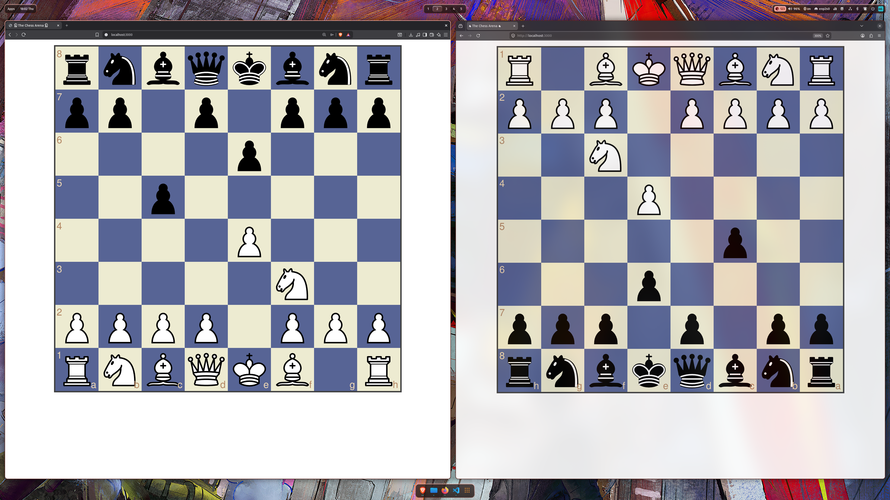

# Chess-0.0 ♞ 
A real-time, browser-based multiplayer chess game built with Node.js, Express, Socket.io, Chess.js and Chessboard.js. Two players can join as White and Black players in order to play against each other.

---

## ⚙️ Features

* **Real-Time Gameplay:** by using WebSocket communication via Socket.io.
* **Turn Validation & State Management:** by using chess.js to ensure only legal chess moves, as well the checks, captures and checkmates that are legal are allowed.
* **Role Assignment:** First connection gets white pieces, second connection gets black connection.
* **Dynamic Board Orientation:** The board automatically flips for the Black player so they see the game from their own perspective.
* **Firefox-Ready Security:** Includes a custom Content Security Policy (CSP) header configuration to prevent rendering blockages on Firefox. (since I tried to see if it works in different browsers such as Brave and Firefox, and Firefox gave the most headache).

---

## 🧰 Tech Stack

* **Backend:** Node.js, Express, Socket.io, chess.js
* **Frontend:** Pug (Template Engine), CSS, chessboard.js (for the interactive UI board; has also inside the jQuery)

---

## 📂 Project Structure
```text
├── public/
│   ├── imgPieces/    # This is the folder where the white*.svg and black*.svg images for the chess pieces are
│   ├── styles.css    # The CSS layout for the pug page gamePage.pug
│   └── client.js     # The client-side script code
├── views/
│   └── gamePage.pug  # the "index.html" but in pug template
├── server.js         # The server/backend
├── package.json
└── README.md
```
---

### 📝 Screenshot


---

### 🔗 Useful Links

* 📦 [Socket.io Documentation](https://socket.io/docs/v4/) — Learn more about the real-time web socket used here.
* ♞ [Chessboard.js API Reference](https://chessboardjs.com/examples) — Explore how the UI board handles drag-and-drop actions.
* ♞ [Chess.js Reference](https://github.com/jhlywa/chess.js/) — Explore the TypeScript chess library for chess move generation/validation, piece placement/movement, and check/checkmate/draw detection
* 📖 [Official Chess Rules (FIDE)](https://handbook.fide.com/chapter/E012018) — If you need a refresher on standard chess laws.

---

### 💿 Installation
Follow these steps to clone the project, install the required packages, and launch the server locally. Make sure you have Node.js installed on your computer.
#### 1 Clone the repository
```text
git clone https://github.com/Beltag-Paula/Chess-0.0.git
```
#### 2 Enter project directory
```text
cd Chess-0.0
```
#### 3 Install dependencies
```text
npm install
```
#### 4 Start the server (use one of the following)
```text
node server.js
```
OR (recommended if nodemon is installed)
```text
nodemon server.js
```

#### 5 Open in browser:
```text
http://localhost:3000/
```
---