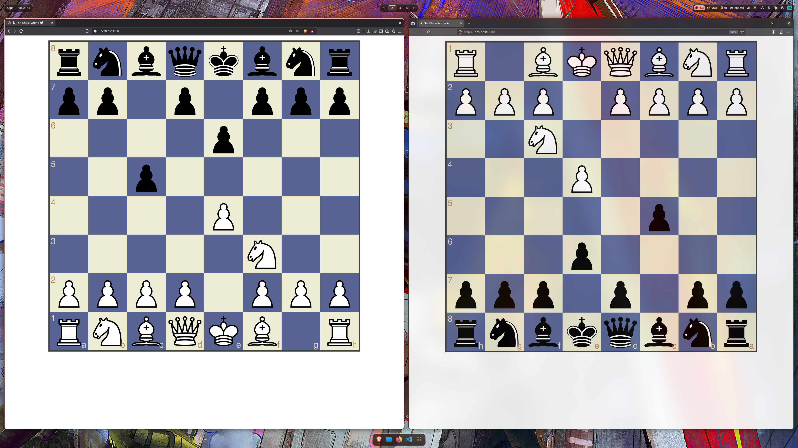
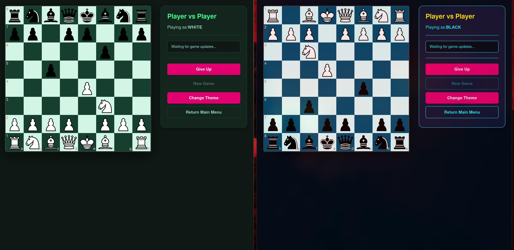
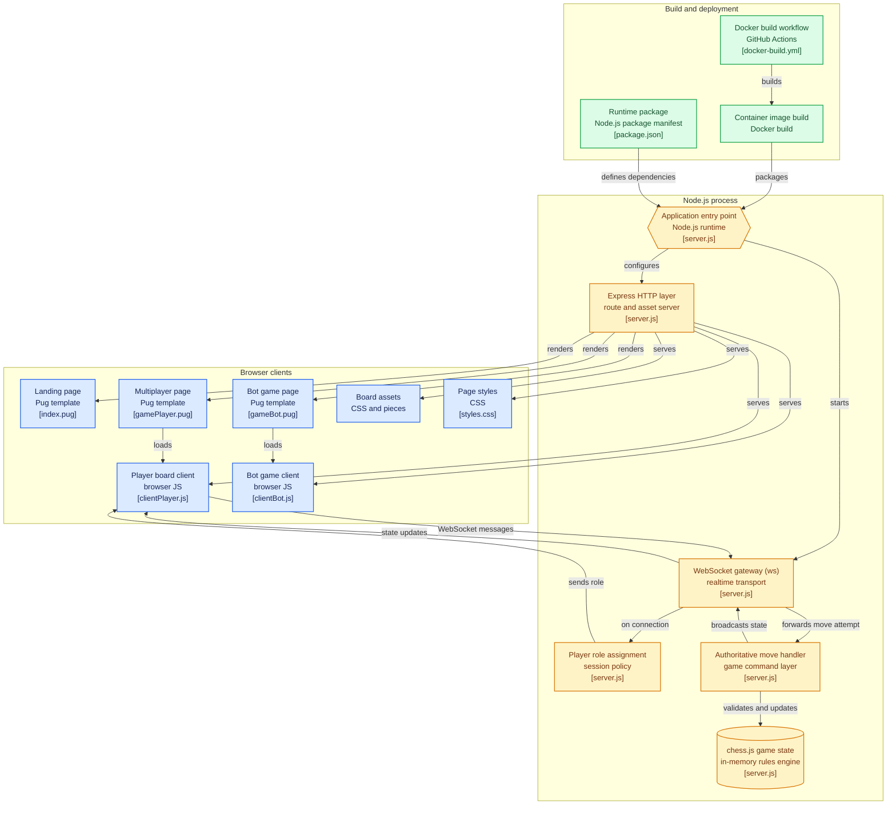

# Chess-0.0
A real-time, browser-based multiplayer chess game built with Node.js, Express, plain WebSockets (`ws`), Chess.js and Chessboard.js. Two players can join as White and Black players in order to play against each other.

---

## Features

* **Real-Time Gameplay:** plain WebSockets (the `ws` library) carrying small JSON messages, with automatic client reconnect.
* **Turn Validation & State Management:** by using chess.js to ensure only legal chess moves, as well the checks, captures and checkmates that are legal are allowed.
* **Role Assignment:** First connection gets white pieces, second connection gets black connection.
* **Dynamic Board Orientation:** The board automatically flips for the Black player so they see the game from their own perspective.
* **Firefox-Ready Security:** Includes a custom Content Security Policy (CSP) header configuration to prevent rendering blockages on Firefox. (since I tried to see if it works in different browsers such as Brave and Firefox, and Firefox gave the most headache).

---

## Tech Stack

* **Backend:** Node.js, Express, ws (WebSocket), chess.js, Stockfish (UCI)
* **Frontend:** Pug (Template Engine), CSS, chessboard.js (for the interactive UI board; has also inside the jQuery)

---

## Game Review (Stockfish analysis)

When a game ends (checkmate, stalemate, draw or resignation) a **Review Game** button appears. It opens `/review/<gameId>`, which streams live progress over the WebSocket while Stockfish evaluates every position, then shows:

* players, **accuracy**, and counts of **Great / Best / Excellent / Mistake / Miss / Blunder** (plus Good / Inaccuracy behind the chevron)
* an estimated **Game Rating** per player
* **Opening / Tactics / Strategy / Endgame** grades per player (the raw material for per-player training later)
* an evaluation graph, eval bar, and move-by-move coach text (arrow keys, click the graph, or use the ⚡ key-moment button)

**How it works** (`lib/review.js`, `lib/analysis.js`): every position is evaluated at depth 13 with 2 lines (MultiPV). A move's *loss* is the win-probability the mover gave up between consecutive positions. Positions next to suspicious moves are then re-searched at depth 16, because one shaky evaluation affects both neighbouring moves. All thresholds live in `THRESHOLDS` in `lib/analysis.js`.

| Label | Meaning |
|---|---|
| Best | engine's top move (or lost < 0.3 win%) |
| Great | the top move, and the 2nd-best move was ≥ 15 win% worse (the "only move") |
| Excellent / Good | lost ≤ 2 / ≤ 5 win% |
| Inaccuracy / Mistake / Blunder | lost ≤ 10 / ≤ 20 / > 20 win% |
| Miss | a mistake-sized loss right after the opponent slipped (a chance you didn't take) |

> **These are estimates, not chess.com's numbers.** Accuracy uses Lichess' published formula. Game Rating is `3100·e^(−0.01·ACPL)` (rounded to 50), a rough yardstick for comparing your own games, and shown only with ≥ 5 moves. The four phase grades are heuristics: Opening = first 10 moves, Endgame = ≤ 6 pieces left, and middlegame moves are split into Tactics (captures/checks/only-moves) vs Strategy (quiet moves). There is no opening book, so there is no "Book" label, and "Brilliant" is not detected.

### Saved data

Everything is saved as plain JSON under `data/` (override with `DATA_DIR`):

* `data/games/<id>.json` — players (`name`, anonymous `playerId`, `isBot`, `elo`), result, UCI move list, PGN
* `data/reviews/<id>.json` — the full review: per-move class / win% loss / accuracy / phase / bucket, per-player summary, eval per position
* `GET /api/reviews/<id>` returns the review as JSON

The `playerId` is a random id kept in the browser's localStorage, which lets you group one person's games. It is **not** authentication (anyone can edit their own localStorage).

### Configuration (environment variables)

| Variable | Default | Meaning |
|---|---|---|
| `PORT` | 3000 | HTTP + WebSocket port |
| `DATA_DIR` | `./data` | where games and reviews are stored |
| `STOCKFISH_PATH` | `./engine/stockfish-bin` | engine binary |
| `REVIEW_DEPTH` / `REVIEW_VERIFY_DEPTH` | 13 / 16 | search depth for the first pass / critical positions |
| `REVIEW_WORKERS` | cores − 1 (1–4) | Stockfish processes per review |
| `REVIEW_CONCURRENCY` | 1 | reviews running at once (others queue) |
| `ALLOWED_ORIGINS` | *(same host only)* | extra allowed `Origin`s, comma separated (e.g. behind a proxy with another hostname) |

## WebSocket protocol

One endpoint, `/ws`. Every message is JSON: `{ "type": "<name>", "data": <any> }`.

| Client → server | Purpose |
|---|---|
| `chooseColor {color,name,playerId}` / `playerMove {from,to,promotion}` / `playerResign` / `restartPlayerGame` | human vs human |
| `setBotColor {color,elo,name,playerId,pgn?}` / `botMove` / `botResign` / `restartBotGame` / `setBotElo` | vs Stockfish (`pgn` resumes a game after a reconnect) |
| `reviewGame {gameId}` | start / fetch a review |

Server → client: `playerBoardState`, `playerGameOver {winner,reason,gameId}`, `playerGameReset`, `colorTaken`, `botBoardState {fen,pgn}`, `botGameOver {winner,reason,gameId}`, `botGameReset`, `botConfig {requestedElo,effectiveElo}`, `botError`, `reviewProgress {stage,done,total}`, `reviewResult`, `reviewError {code,message}`.

## Tests

```text
npm test
```

Unit tests for the analysis maths, plus integration tests that start the server and play real games over WebSockets against the real Stockfish binary (skipped if `engine/stockfish-bin` is missing).

## Project Structure
```text
├── public/
│   ├── imgPieces/       # white*.svg / black*.svg piece images
│   ├── styles.css       # themes + layout (incl. the review page)
│   ├── wsClient.js      # GameSocket: WebSocket wrapper with JSON messages + auto-reconnect
│   ├── identity.js      # player name + anonymous id (localStorage)
│   ├── clientBot.js     # vs Stockfish page
│   ├── clientPlayer.js  # vs human page
│   └── clientReview.js  # review page (report, graph, move list)
├── views/               # pug templates (index, gameBot, gamePlayer, review)
├── lib/
│   ├── uciEngine.js     # Stockfish process wrapper (bot moves + analysis)
│   ├── analysis.js      # pure maths: win%, accuracy, classification, rating
│   ├── review.js        # replays a game and evaluates it with Stockfish
│   ├── reviewService.js # cache, dedupe, queue / concurrency limit
│   └── store.js         # JSON persistence for games and reviews
├── test/
├── server.js            # HTTP routes + WebSocket server
├── package.json
└── README.md
```
---

### Screenshot of development


[](https://www.youtube.com/watch?v=EfV3KD0RC1Y) 

[](https://www.youtube.com/watch?v=AmU0f8L3Cic)


---

### 🔗 Useful Links

* [ws Documentation](https://github.com/websockets/ws) — The WebSocket library used here.
* [Chessboard.js API Reference](https://chessboardjs.com/examples) — Explore how the UI board handles drag-and-drop actions.
* [Chess.js Reference](https://github.com/jhlywa/chess.js/) — Explore the TypeScript chess library for chess move generation/validation, piece placement/movement, and check/checkmate/draw detection
* [Official Chess Rules (FIDE)](https://handbook.fide.com/chapter/E012018) — If you need a refresher on standard chess laws.

---

### Installation
Follow these steps to clone the project, install the required packages, and launch the server locally. Make sure you have Node.js installed on your computer.
#### 1 Clone the repository
```text
git clone https://github.com/Beltag-Paula/Chess-0.0.git
```
#### 2 Enter project directory
```text
cd Chess-0.0
```
#### 3 Install dependencies
```text
npm install
```
#### 4 Start the server (use one of the following)
```text
node server.js
```
OR (recommended if nodemon is installed)
```text
nodemon server.js
```

#### 5 Open in browser:
```text
http://localhost:3000/
```
---
#### Diagram:


```mermaid
flowchart TD

subgraph group_browser["Browser clients"]
  node_landing["Landing page<br/>Pug template<br/>[index.pug]"]
  node_player_page["Multiplayer page<br/>Pug template<br/>[gamePlayer.pug]"]
  node_bot_page["Bot game page<br/>Pug template<br/>[gameBot.pug]"]
  node_player_client["Player board client<br/>browser JS<br/>[clientPlayer.js]"]
  node_bot_client["Bot game client<br/>browser JS<br/>[clientBot.js]"]
  node_board_assets["Board assets<br/>CSS and pieces"]
  node_styles["Page styles<br/>CSS<br/>[styles.css]"]
end

subgraph group_server["Node.js process"]
  node_express["Express HTTP layer<br/>route and asset server<br/>[server.js]"]
  node_socket_gateway["WebSocket gateway (ws)<br/>realtime transport<br/>[server.js]"]
  node_role_assignment["Player role assignment<br/>session policy<br/>[server.js]"]
  node_move_handler["Authoritative move handler<br/>game command layer<br/>[server.js]"]
  node_chess_state[("chess.js game state<br/>in-memory rules engine<br/>[server.js]")]
  node_entrypoint{{"Application entry point<br/>Node.js runtime<br/>[server.js]"}}
end

subgraph group_delivery["Build and deployment"]
  node_dockerfile["Container image build<br/>Docker build"]
  node_ci_build["Docker build workflow<br/>GitHub Actions<br/>[docker-build.yml]"]
  node_package["Runtime package<br/>Node.js package manifest<br/>[package.json]"]
end

node_entrypoint -->|"configures"| node_express
node_entrypoint -->|"starts"| node_socket_gateway

node_express -->|"renders"| node_landing
node_express -->|"renders"| node_player_page
node_express -->|"renders"| node_bot_page

node_express -->|"serves"| node_player_client
node_express -->|"serves"| node_bot_client
node_express -->|"serves"| node_styles
node_express -->|"serves"| node_board_assets

node_player_page -->|"loads"| node_player_client
node_bot_page -->|"loads"| node_bot_client

node_player_client -->|"WebSocket messages"| node_socket_gateway

node_socket_gateway -->|"on connection"| node_role_assignment
node_role_assignment -->|"sends role"| node_player_client

node_socket_gateway -->|"forwards move attempt"| node_move_handler
node_move_handler -->|"validates and updates"| node_chess_state
node_move_handler -->|"broadcasts state"| node_socket_gateway
node_socket_gateway -->|"state updates"| node_player_client

node_ci_build -->|"builds"| node_dockerfile
node_dockerfile -->|"packages"| node_entrypoint
node_package -->|"defines dependencies"| node_entrypoint

classDef toneNeutral fill:#f8fafc,stroke:#334155,stroke-width:1.5px,color:#0f172a
classDef toneBlue fill:#dbeafe,stroke:#2563eb,stroke-width:1.5px,color:#172554
classDef toneAmber fill:#fef3c7,stroke:#d97706,stroke-width:1.5px,color:#78350f
classDef toneMint fill:#dcfce7,stroke:#16a34a,stroke-width:1.5px,color:#14532d
classDef toneRose fill:#ffe4e6,stroke:#e11d48,stroke-width:1.5px,color:#881337
classDef toneIndigo fill:#e0e7ff,stroke:#4f46e5,stroke-width:1.5px,color:#312e81
classDef toneTeal fill:#ccfbf1,stroke:#0f766e,stroke-width:1.5px,color:#134e4a

class node_landing,node_player_page,node_bot_page,node_player_client,node_bot_client,node_board_assets,node_styles toneBlue
class node_express,node_socket_gateway,node_role_assignment,node_move_handler,node_chess_state,node_entrypoint toneAmber
class node_dockerfile,node_ci_build,node_package toneMint
```